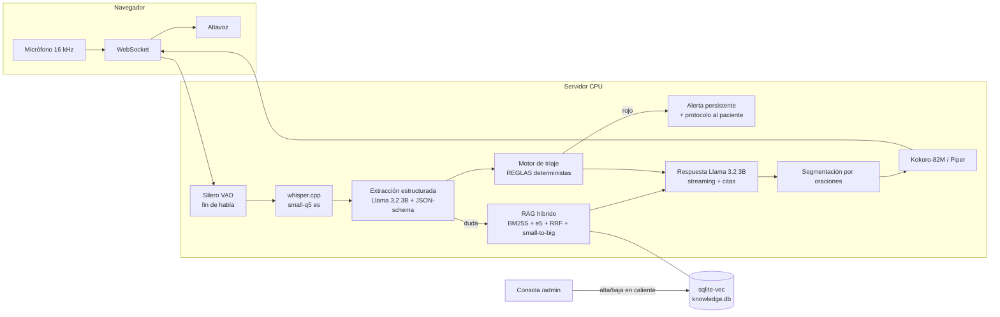

# Clara — Agente de voz para seguimiento postoperatorio

Agente conversacional de voz en español que llama al paciente tras una cirugía,
evalúa su evolución (dolor, fiebre, herida, movilidad, apetito y sueño), responde
sus dudas **fundamentado en guías clínicas con citas verificables**, decide con una
**lógica de triaje determinista** cuándo alertar a un humano, y deja un **resumen
estructurado** de cada llamada.

**100 % local, 100 % CPU, 0 GPU, ~$0 de APIs.** Diseñado para correr en un equipo
básico de 8 GB de RAM.

- Modelo de lenguaje: **Llama 3.2 3B Instruct (Q4_K_M)** — de la lista permitida,
  servido con `llama-server` (llama.cpp). Por qué: ver
  [`docs/DECISIONES-ARQUITECTURA.md`](docs/DECISIONES-ARQUITECTURA.md).
- Voz: whisper.cpp (STT es) · Silero VAD · Kokoro-82M es (TTS) con fallback Piper.
- RAG "mejorado": híbrido BM25S + denso (multilingual-e5-small int8) con fusión RRF,
  small-to-big, filtro por escenario quirúrgico, corpus bilingüe ES/EN sin traducción
  y **conocimiento vivo** (alta/baja de documentos en caliente, olvido transaccional).

## Levantamiento (≤ 15 minutos)

Requisitos: Linux x64 (o WSL2) · Python 3.10+ · `curl` · ~6 GB de disco ·
opcional `tesseract-ocr tesseract-ocr-spa` para PDFs escaneados.

```bash
git clone <URL-DE-ESTE-REPO> && cd postop-voice-agent

# 1) Dependencias (1-2 min)
python3 -m venv .venv && .venv/bin/pip install -r requirements.txt

# 2) Modelos (~3.1 GB, 5-10 min según red)
bash scripts/download_models.sh

# 3) Arrancar (levanta también llama-server automáticamente)
bash scripts/run.sh
```

Abrir **http://127.0.0.1:8000** → interfaz de llamada (permitir micrófono).
**http://127.0.0.1:8000/admin** → consola de conocimiento.

Para cargar el corpus del reto (opcional, ~30-60 min en CPU; el agente funciona
desde el primer documento que se suba por la consola):

```bash
POSTOP_DATASET_DIR=/ruta/a/dataset .venv/bin/python scripts/ingest_corpus.py
```

### Perfil de hardware

| Variable | Efecto |
|---|---|
| `POSTOP_PROFILE=principal` (defecto) | whisper small + Kokoro (~7 GB totales) |
| `POSTOP_PROFILE=ligero` | whisper base + Piper (~5.5 GB totales, menor latencia) |
| `POSTOP_LLM_THREADS` / `POSTOP_STT_THREADS` | Hilos de CPU (defecto **4**: el equipo de despliegue objetivo tiene 4 núcleos; súbelos si tu CPU tiene más) |

## Arquitectura



**Flujo de decisión del turno:** transcripción → extracción de síntomas a JSON
(decodificación restringida: JSON inválido imposible) → *merge* al estado de la
llamada → **reglas clínicas deterministas** (el nivel solo puede subir; ante
ambigüedad el agente indaga antes de decidir) → si **rojo**: alerta inmediata
persistente y protocolo de cierre; si duda del paciente: RAG con citas [n]; en
otro caso: siguiente punto del guion clínico.

Por qué el LLM **no** decide el triaje: en pruebas, el 3B con salida restringida
subestimó casos rojos claros. La extracción sí es fiable; la decisión clínica es
de reglas auditables derivadas de los signos de alarma de las guías. Falso
negativo = falla catastrófica (asimetría clínica del reto).

## Métricas (obligatorias por la rúbrica)

Se loggean automáticamente por turno en `data/logs/turnos.jsonl` y se agregan en
`GET /api/metrics` (visibles en la consola /admin).

<!-- METRICAS: se actualizan con la medición real -->
| Métrica | Valor medido |
|---|---|
| Latencia P50 (fin de habla → primer audio) | _pendiente de medición final_ |
| Latencia P95 | _pendiente_ |
| Tokens entrada/salida por turno (prom.) | _pendiente_ |
| Invocaciones LLM por turno | 2 (extracción + respuesta; +1 resumen por llamada) |
| Consultas RAG por llamada | _pendiente_ |
| Costo por llamada | $0 local; extrapolado a API: _pendiente_ |

Verificación: `data/logs/turnos.jsonl`, `llamadas.jsonl`, `alertas.jsonl`.

## Estructura

```
app/            servidor FastAPI, LLM, STT, TTS, VAD, métricas
app/rag/        ingesta, embeddings, almacén sqlite-vec, búsqueda híbrida, léxico ES↔EN
app/agent/      orquestador conversacional, prompts, triaje determinista
web/            interfaz de llamada y consola de administración
scripts/        descarga de modelos, arranque, ingesta, evaluación de triaje, E2E
docs/           reglas fijas del reto, decisiones de arquitectura (ADR), investigación
```

## Evaluación reproducible

```bash
.venv/bin/python scripts/eval_triage.py      # triaje vs label_ground_truth del dataset
.venv/bin/python scripts/e2e_test.py         # llamada completa sintética vía WebSocket
```
