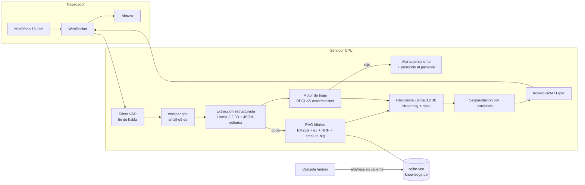

# Clara — Agente de voz para seguimiento postoperatorio

Agente conversacional de voz en español que llama al paciente tras una cirugía,
evalúa su evolución (dolor, fiebre, herida, movilidad, apetito y sueño), responde
sus dudas **fundamentado en guías clínicas con citas verificables**, decide con una
**lógica de triaje determinista** cuándo alertar a un humano, y deja un **resumen
estructurado** de cada llamada.

**100 % local, 100 % CPU, 0 GPU, ~$0 de APIs.** Diseñado para correr en un equipo
básico de 8 GB de RAM.

- Modelo de lenguaje: **Llama 3.2 3B Instruct (Q4_K_M)** — de la lista permitida,
  servido con `llama-server` (llama.cpp). Por qué: ver
  [`docs/DECISIONES-ARQUITECTURA.md`](docs/DECISIONES-ARQUITECTURA.md).
- Voz: whisper.cpp (STT es) · Silero VAD · Kokoro-82M es (TTS) con fallback Piper.
- RAG "mejorado": híbrido BM25S + denso (multilingual-e5-small int8) con fusión RRF,
  small-to-big, filtro por escenario quirúrgico, corpus bilingüe ES/EN sin traducción
  y **conocimiento vivo** (alta/baja de documentos en caliente, olvido transaccional).

## Levantamiento (≤ 15 minutos)

Requisitos: Linux x64 (o WSL2) · Python 3.10+ · `curl` · ~6 GB de disco ·
opcional `tesseract-ocr tesseract-ocr-spa` para PDFs escaneados.

> Ensayo cronometrado desde clon limpio: **~7,5 min hasta el sistema corriendo**
> (clonado 2 s · dependencias 1,5 min · modelos 5,8 min según red · arranque 17 s).
> En WSL2, clona en el sistema de archivos de Linux (`~/`), no en `/mnt/c`: la
> ingesta y la carga de modelos son varias veces más rápidas.

```bash
git clone <URL-DE-ESTE-REPO> && cd postop-voice-agent

# 1) Dependencias (1-2 min)
python3 -m venv .venv && .venv/bin/pip install -r requirements.txt

# 2) Modelos (~3.1 GB, 5-10 min según red)
bash scripts/download_models.sh

# 3) Arrancar (levanta también llama-server automáticamente)
bash scripts/run.sh
```

Abrir **http://localhost:8000** → interfaz de llamada (permitir micrófono).
**http://localhost:8000/admin** → consola de conocimiento.

> **WSL2 + navegador de Windows:** si `localhost:8000` no abre desde Windows,
> arranca el servidor con `POSTOP_HOST=0.0.0.0 bash scripts/run.sh` y ejecuta
> `scripts/windows_portproxy.ps1` en PowerShell **como administrador** (reenvía
> localhost de Windows a WSL; re-ejecútalo si reinicias, la IP de WSL cambia).
> El micrófono requiere origen seguro: usa `localhost` o `127.0.0.1`, nunca la IP.

Para cargar el corpus del reto (opcional, ~30-60 min en CPU; el agente funciona
desde el primer documento que se suba por la consola):

```bash
POSTOP_DATASET_DIR=/ruta/a/dataset .venv/bin/python scripts/ingest_corpus.py
```

### Perfil de hardware

| Variable | Efecto |
|---|---|
| `POSTOP_PROFILE=principal` (defecto) | whisper small + Kokoro (~7 GB totales) |
| `POSTOP_PROFILE=ligero` | whisper base + Piper (~5.5 GB totales, menor latencia) |
| `POSTOP_LLM_THREADS` / `POSTOP_STT_THREADS` | Hilos de CPU (defecto **4**: el equipo de despliegue objetivo tiene 4 núcleos; súbelos si tu CPU tiene más) |

## Arquitectura



**Flujo de decisión del turno:** transcripción → extracción de síntomas a JSON
(decodificación restringida: JSON inválido imposible) → *merge* al estado de la
llamada → **reglas clínicas deterministas** (el nivel solo puede subir; ante
ambigüedad el agente indaga antes de decidir) → si **rojo**: alerta inmediata
persistente y protocolo de cierre; si duda del paciente: RAG con citas [n]; en
otro caso: siguiente punto del guion clínico.

Por qué el LLM **no** decide el triaje: en pruebas, el 3B con salida restringida
subestimó casos rojos claros. La extracción sí es fiable; la decisión clínica es
de reglas auditables derivadas de los signos de alarma de las guías. Falso
negativo = falla catastrófica (asimetría clínica del reto).

## Métricas (obligatorias por la rúbrica)

Se loggean automáticamente por turno en `data/logs/turnos.jsonl` y se agregan en
`GET /api/metrics` (visibles en la consola /admin).

Medidas en CPU restringida a **4 núcleos** (`taskset -c 0-3`, hilos LLM/STT = 4),
perfil `principal` (whisper small + Kokoro), sobre 6 llamadas E2E sintéticas
(15 turnos: casos rojo con escalamiento y verde con consulta al RAG):

| Métrica | Valor medido |
|---|---|
| Latencia P50 (fin de habla → primer audio) | **12,0 s** |
| Latencia P95 | **15,0 s** |
| Tokens por turno (entrada / salida, prom.) | 1 420 / 126 |
| Tokens por llamada (prom.) | 3 864 |
| Invocaciones LLM por turno (prom.) | 1,6 (extracción condicionada + respuesta; el atajo rojo léxico responde sin LLM) |
| Consultas RAG por llamada (prom.) | 1,0 (solo cuando el paciente pregunta) |
| Costo por llamada | **$0 real (local)** · extrapolado a API pública: ~$0,0023 (Groq Llama-3.3-70B) / ~$0,0019 (Gemini Flash) |

Notas de honestidad y contexto:

- **La latencia la domina el prefill del LLM en CPU** (~100 tok/s con 4 núcleos).
  Los escalamientos rojos por señal léxica responden en **~7 s** (STT ~4 s + frase
  pre-sintetizada, sin pasar por el modelo).
- **Durante los silencios el agente no calla**: al consultar el corpus reproduce
  de inmediato «Permítame revisar sus indicaciones un momento» (pre-sintetizada),
  de modo que el turno con RAG suena al instante aunque la respuesta tarde. Sin
  esa cobertura el P95 era de 44 s; con ella, 15 s.
- Las mediciones se tomaron en una máquina que además ejecutaba un entrenamiento
  ajeno al proyecto (condiciones pesimistas), y con el LLM y la app compitiendo
  por los mismos 4 núcleos —igual que haría el equipo de despliegue objetivo—.
- El perfil `ligero` (`POSTOP_PROFILE=ligero`: whisper base + Piper) recorta
  ~3 s por turno a cambio de algo de precisión en el reconocimiento.
- Desglose por turno en `data/logs/turnos.jsonl`; agregado en `GET /api/metrics`
  y visible en la consola `/admin`.

**Lógica de decisión (evaluada contra el dataset del reto, capa limpia, 57 casos:
12 rojos + 25 amarillos + 20 verdes):**

| Métrica de triaje | Resultado |
|---|---|
| Falsos negativos, capa limpia | **0 / 57** |
| Falsos negativos, capa ruidosa (evasivas, datos faltantes, interrupciones de familiares) | **0 / 57** |
| Recall de casos rojos | **12 / 12** en ambas capas |
| Matriz, capa limpia | verde: 5-7-8 · amarillo: 0-5-20 · rojo: 0-0-12 (filas=real, cols=verde/amarillo/rojo) |
| Matriz, capa ruidosa | verde: 4-7-9 · amarillo: 0-8-17 · rojo: 0-0-12 |

Calibración deliberadamente sensible (asimetría clínica del reto): el costo del
0 % de subestimación es sobre-escalamiento en casos ambiguos. La capa ruidosa es
la prueba dura —el paciente evade, minimiza («un poquito molesto, uno aguanta»
con dolor real de 9/10) y un familiar interrumpe—; el agente mantiene el 100 % de
recall en rojos. Detalle y método en
[`docs/INFORME-FINAL.md`](docs/INFORME-FINAL.md) §2; reproducible con
`scripts/eval_triage.py`.

Verificación: `data/logs/turnos.jsonl`, `llamadas.jsonl`, `alertas.jsonl`,
`eval_triage_capa1_limpia.json`.

## Estructura

```
app/            servidor FastAPI, LLM, STT, TTS, VAD, métricas
app/rag/        ingesta, embeddings, almacén sqlite-vec, búsqueda híbrida, léxico ES↔EN
app/agent/      orquestador conversacional, prompts, triaje determinista
web/            interfaz de llamada y consola de administración
scripts/        descarga de modelos, arranque, ingesta, evaluación de triaje, E2E
docs/           reglas fijas del reto, decisiones de arquitectura (ADR), investigación
```

## Evaluación reproducible

```bash
.venv/bin/python scripts/eval_triage.py      # triaje vs label_ground_truth del dataset
.venv/bin/python scripts/e2e_test.py         # llamada completa sintética vía WebSocket
```
