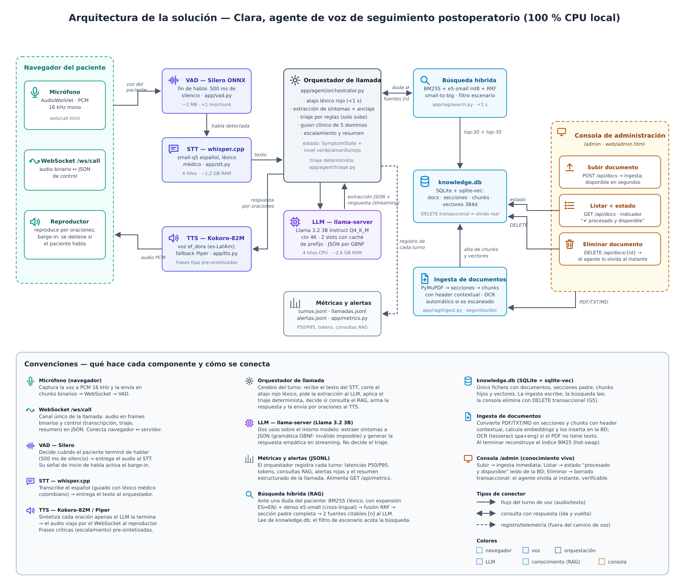
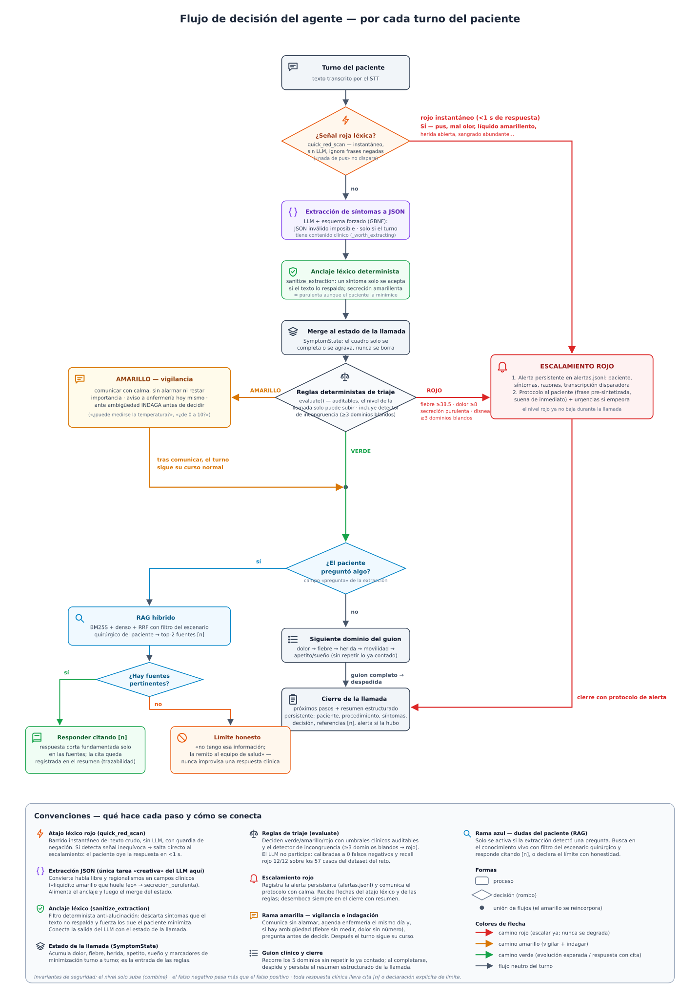
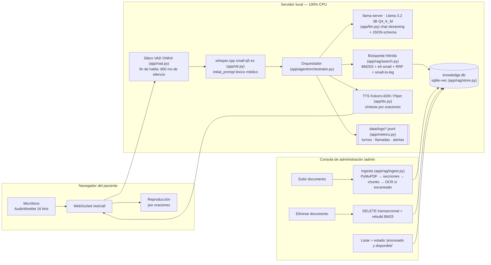
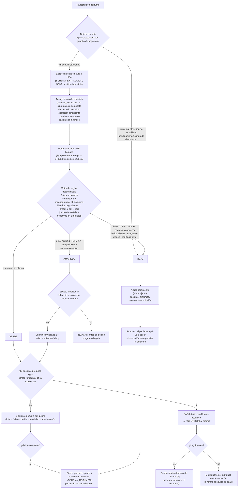

# Diagramas — arquitectura y flujo de decisión

> Entregable 02. Cada elemento corresponde a código real del repositorio
> (módulo indicado entre paréntesis).

## Versión en imagen (oficial)

Fuentes editables: [`diagramas/arquitectura.svg`](diagramas/arquitectura.svg) y
[`diagramas/flujo-decision.svg`](diagramas/flujo-decision.svg). Cada imagen incluye
su recuadro de convenciones con la función de cada componente y sus conexiones.

---

## Versión mermaid (referencia rápida en texto)

### Arquitectura de la solución

### Flujo de decisión del agente (por turno de paciente)

**Invariantes de seguridad:** el nivel de triaje de la llamada solo sube
(`triage.combine`); el falso negativo pesa más que el falso positivo (reglas
conservadoras + combinación fiebre+herida→rojo); toda respuesta clínica lleva
fuente o declaración explícita de límite.
